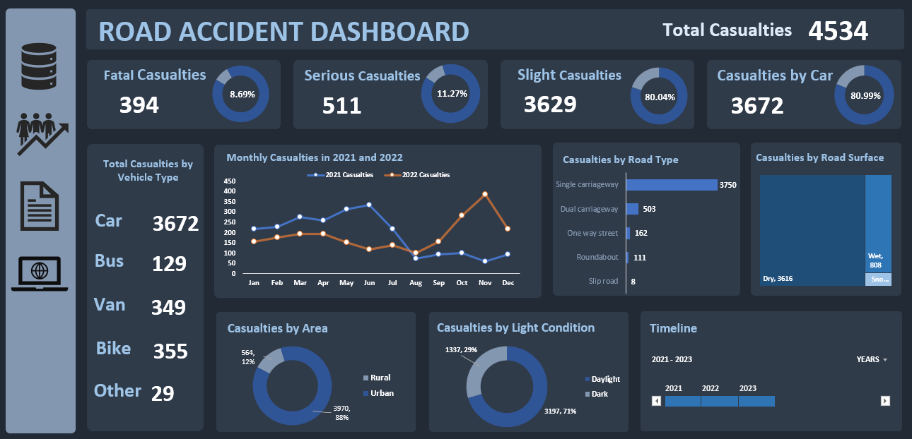

# Road Accident Dashboard

## Introduction

This project aims to provide a comprehensive analysis of road accidents using an interactive dashboard created in Excel. The dashboard visualizes various aspects of road accidents, including the number of casualties, the type of roads where accidents occur, and the conditions under which these accidents happen.

To find the dashboard please navigate to  `PetrovicsRobert/Road-Accident` and click on `Road Accident.xlsx` to open it.

## Data Cleaning Steps

#### Checking for Duplicated Values: 
Verified the dataset to ensure there were no duplicate rows. None were found.

#### Standardizing Data: 
Fixed values with typos by finding and replacing them with the correct spelling to maintain consistency in the dataset.

#### Checking for Blank Values: 
Ensured that there were no blank values in essential columns. None were found.

#### Extracting Month and Year from Date: 
Extracted the month and year from the date column to visualize monthly trends more effectively.

## Dashboard Insights

#### Total Casualties: 
There are a total of 4534 casualties, with 394 being fatal, 511 serious, and 3629 slight.
#### Vehicle Type: 
The majority of casualties involved cars (3672), followed by bikes (355), vans (349), and buses (129).
#### Road Type: 
Most accidents occurred on single carriageways (3750), with fewer on dual carriageways (503) and other road types.
#### Road Surface: 
Accidents mainly happened on dry surfaces (3616), with fewer on wet (808) and snowy surfaces.
#### Area and Light Conditions: 
Urban areas had more casualties (3970) compared to rural areas (564). Most accidents occurred in daylight (3197) compared to dark conditions (1337).
#### Monthly Trends: 
The monthly trend shows variations in casualties between 2021 and 2022, with noticeable peaks in certain months.
